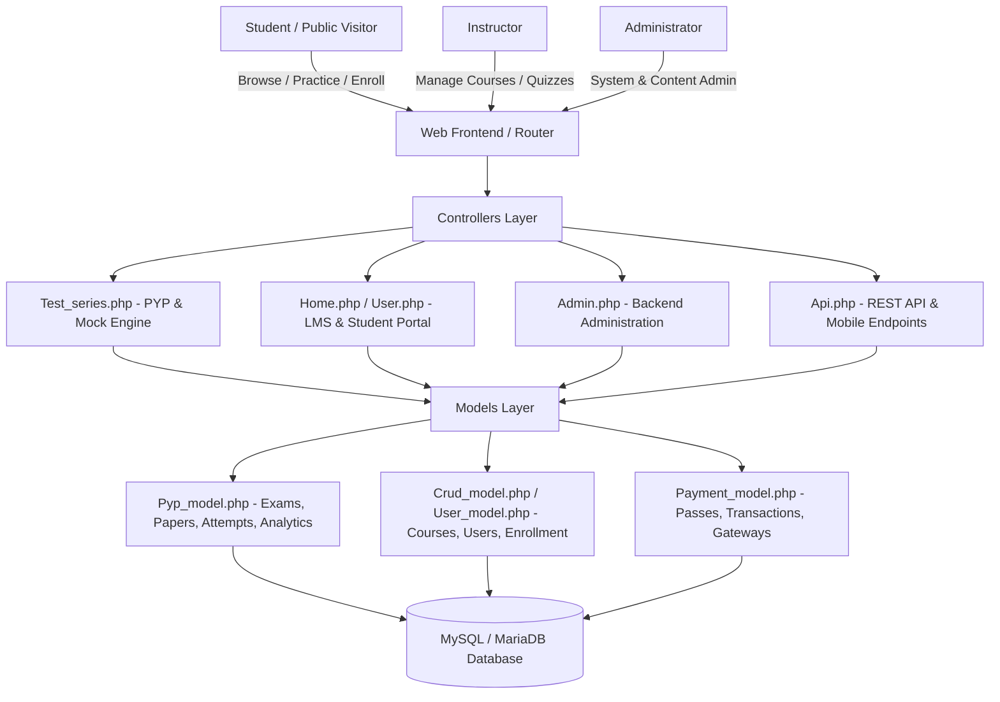
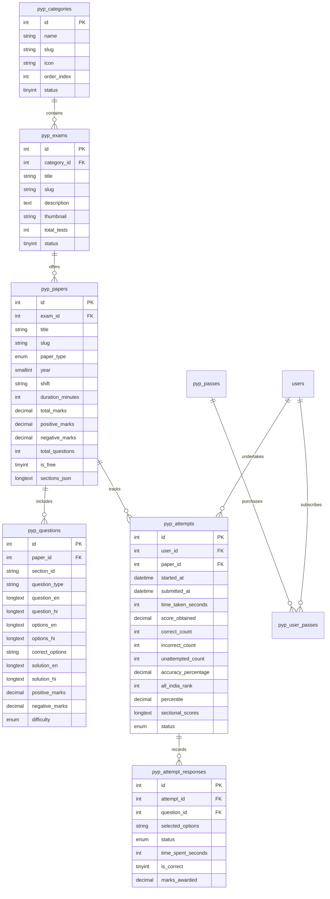

# Product Requirement Document (PRD) & Technical Architecture
## Project: PyQL (pyql.in) - E-Learning & CBT Examination Platform

---

## 1. Executive Summary & Vision

**PyQL (`pyql.in`)** is an integrated EdTech platform combining a full-featured **Learning Management System (LMS)** with an Indian competitive examination **CBT (Computer Based Test) Engine**.

The platform is designed to provide students with high-yield preparation tools for major national and state competitive exams (including **SSC CGL/CHSL, Banking/IBPS, Railways/RRB, UPSC Civil Services & Defense CDS/NDA, Teaching/TET, and State PSCs**), paired with structured video courses, bilingual test interfaces (English & Hindi), real-time performance analytics, All-India Rank (AIR) percentiles, and subscription-based access passes.

---

## 2. User Personas & Target Audience

| Persona | Description | Key Objectives |
| :--- | :--- | :--- |
| **Aspirant / Student** | Government job aspirant preparing for competitive exams in India. | Practice previous year question papers in a real CBT exam simulator, analyze strengths/weaknesses via detailed solutions, compare percentiles, and watch video lectures. |
| **Instructor / Educator** | Domain expert or content creator. | Publish recorded courses, build modular curriculums with drip content, upload practice quizzes, and track earnings/payouts. |
| **Platform Administrator** | Operational and academic administrator. | Manage exams, categories, papers, and bilingual question banks; manage users, financial gateways, subscription passes, and monitor platform health. |

---

## 3. Technology Stack

- **Backend Framework**: PHP 7.4 / 8.0+ on CodeIgniter 3 (MVC Architecture)
- **Database**: MySQL 5.7+ / MariaDB 10.4+ (InnoDB, `utf8mb4` encoding)
- **Frontend Core**: HTML5, CSS3, JavaScript (Vanilla ES6 + jQuery), Bootstrap 4/5
- **Icons & UI Utilities**: FontAwesome 5/6, Feather Icons, DataTables, SweetAlert2, MathJax/KaTeX (for mathematical formulas)
- **CI/CD & DevOps**: GitHub Actions CI (`.github/workflows/ci.yml`), Composer v2
- **Payment Gateways**: Razorpay, Stripe, Cashfree, PayPal, Paystack, Flutterwave, Offline Bank Transfers
- **Media & Storage**: Local server filesystem with Wasabi / AWS S3 compatibility layer

---

## 4. System Architecture & High-Level Flow



---

## 5. Core Functional Modules

### 5.1 PYP & Mock Test Examination Engine (`Test_series.php`)
1. **Exam & Category Catalog**:
   - Hierarchical organization: `Categories` -> `Exams` -> `Papers` -> `Questions`.
   - Filter by exam category (SSC, Banking, Railways, Civil Services, etc.) and paper types (`PREVIOUS_YEAR`, `MOCK_TEST`, `SECTIONAL`).
2. **CBT Simulation Interface (`pyp_exam_engine.php`)**:
   - Faithful replica of TCS-iON / NTA competitive exam interfaces.
   - **Countdown Timer**: Real-time timer with client-side decrement and server-synced time tracking.
   - **Bilingual Switcher**: Instant switching between English and Hindi per question without reloading.
   - **Interactive Question Palette**:
     - *Green*: Answered
     - *Red*: Not Answered
     - *Purple*: Marked for Review
     - *Purple with Green dot*: Answered & Marked for Review
     - *Grey*: Not Visited
   - **Section Navigation**: Tabbed switching between exam sections (e.g. General Intelligence, General Awareness, Quantitative Aptitude, English Comprehension) with sectional question counts and time restrictions.
   - **Save & Next / Clear Response / Mark for Review** actions.
3. **Scoring & Performance Analytics (`pyp_scorecard.php`, `pyp_solutions.php`)**:
   - Instant calculation of positive marks, negative marks, and net score.
   - Accuracy percentage, time spent per question, and sectional performance breakdown.
   - All-India Rank (AIR) and percentile ranking dynamically calculated against all previous attempts.
   - Detailed step-by-step bilingual solutions (`solution_en`, `solution_hi`).
4. **Subscription Passes (`pyp_passes`, `pyp_user_passes`)**:
   - Access pass tiers (Monthly, Quarterly, Annual, Lifetime).
   - Unlocks premium mock tests and previous year papers.

### 5.2 Learning Management System (LMS Core)
1. **Course Catalog & Player**:
   - Video player with support for HTML5, YouTube, Vimeo, and cloud video sources.
   - Curriculum builder: Sections, Lessons (Video, Document, Text, Quiz), and Drip Content scheduling.
   - Course enrollment (Free & Paid).
2. **Instructor Workflow**:
   - Course creation wizard, pricing setup, payout requests, revenue share tracking.
3. **Student Profile & Certificates**:
   - Progress bar tracking completed lessons.
   - Automated certificate generation upon 100% course completion.

### 5.3 Administrative Control Panel (`Admin.php`)
1. **PYP Content Management**:
   - Category management (`pyp_categories`).
   - Exam setup with thumbnails and test counts (`pyp_exams`).
   - Paper editor with section schemas (`sections_json`), negative marking rules, and time limits (`pyp_papers`).
   - Bilingual Question Bank editor (`pyp_questions`) with MathJax and image support.
   - Bulk question import utilities (`pyp_import.php`).
2. **User & Access Governance**:
   - Role-Based Access Control (Admins, Instructors, Students).
   - Device login limits and session monitoring.
3. **Financials & Payment Gateways**:
   - Key configuration for Razorpay, Stripe, Cashfree, PayPal, etc.
   - Pass sales reporting and instructor payout approvals.

---

## 6. Database Schema & Data Dictionary

### Core PYP Tables


---

## 7. Project Directory Structure

```text
c:\xampp\htdocs\pyql\
├── .github\
│   └── workflows\
│       └── ci.yml                 # GitHub Actions CI syntax lint & validation pipeline
├── application\                   # CodeIgniter 3 Application Layer
│   ├── config\                    # Environment, database, autoload, and route configs
│   ├── controllers\               # HTTP Request Handlers
│   │   ├── Admin.php              # Full Admin dashboard & management
│   │   ├── Api.php                # REST API endpoints for client applications
│   │   ├── Home.php               # Public homepage, course catalog, search
│   │   ├── Payment.php            # Checkout, webhooks, payment verification
│   │   ├── Test_series.php        # Primary PYP & CBT examination engine controller
│   │   └── User.php               # Student dashboard, course progress, profile
│   ├── models\                    # Business Logic & Database Abstraction
│   │   ├── Crud_model.php         # Course, category, and LMS CRUD operations
│   │   ├── Payment_model.php      # Payment gateway transaction handling
│   │   ├── Pyp_model.php          # Exam engine, papers, questions, attempts, ranks
│   │   └── User_model.php         # User authentication, profiles, permissions
│   ├── views\                     # HTML Templates & View Components
│   │   ├── backend\admin\         # Admin control panel layouts and views
│   │   │   ├── pyp_papers.php     # Admin paper listing and actions
│   │   │   ├── pyp_paper_add.php  # Paper creation with section builders
│   │   │   ├── pyp_questions.php  # Question bank management
│   │   │   └── pyp_import.php     # Bulk question import interface
│   │   └── frontend\default-new\  # Modern student-facing views
│   │       ├── pyp_portal.php     # Test series landing catalog
│   │       ├── pyp_exam_papers.php# Papers available under a selected exam
│   │       ├── pyp_instructions.php # Pre-exam guidelines and language select
│   │       ├── pyp_exam_engine.php# Real-time CBT exam screen
│   │       ├── pyp_scorecard.php  # Result summary, AIR rank & sectional stats
│   │       └── pyp_solutions.php  # In-depth bilingual solution review
│   ├── libraries\                 # Custom & third-party libraries (Stripe, etc.)
│   └── helpers\                   # CodeIgniter helper functions
├── assets\                        # Static Assets
│   ├── backend\                   # Admin UI stylesheets, scripts, plugins
│   └── frontend\default-new\      # Public and student portal UI styling
├── system\                        # CodeIgniter 3 Framework Core
├── uploads\                       # Dynamic user & system uploads
├── scratch\                       # Diagnostic, inspection, and verification scripts
├── dev\                           # Development sandbox replica
├── shm\                           # Legacy Smart Hospital submodule source
├── backups\ & old_backup\         # Historical backup snapshots and database dumps
├── composer.json                  # Composer dependencies (vfsstream, phpunit)
├── index.php                      # Web server entry point
└── pyp_migration.sql              # Target database schema & initial seed data
```

---

## 8. Non-Functional Requirements & Security Hardening

1. **Bilingual Rendering & Math Notation**:
   - Database columns for questions, options, and solutions use `LONGTEXT` with `utf8mb4_unicode_ci` to flawlessly support Hindi (Devanagari script), special mathematical symbols, and HTML entities.
2. **CBT Client Resilience**:
   - Local state preservation in the browser (LocalStorage/SessionStorage) during active exams to prevent data loss in the event of brief network disconnections.
3. **Secret Protection & API Security**:
   - All production API keys (Razorpay, Stripe, etc.) must be stored securely in the database or server environment variables; dummy test credentials are sanitized to respect GitHub Push Protection.
4. **PHP 8 Compatibility**:
   - Modern dynamic property syntax (`$this->{'_compile_'.$var}`) implemented across system and application libraries.
5. **Database Indexing**:
   - Foreign keys and frequent filter paths (`exam_id`, `paper_id`, `user_id`, `status`) are indexed for sub-100ms response times even with 100,000+ questions.

---

## 9. Recommendations & Immediate Roadmap

1. **Codebase Cleanliness**:
   - The large auxiliary folders (`dev/`, `shm/`, `backups/`) contain duplicate code and legacy databases. Consider archiving them into separate repositories or adding them to `.gitignore` to keep the primary `pyql` repo lightweight.
2. **Caching Layer**:
   - Implement Redis or Memcached for frequently accessed read-heavy queries (e.g. `pyp_categories`, `pyp_exams`, featured papers list).
3. **Automated Unit & Integration Tests**:
   - Expand the GitHub Actions CI pipeline with automated PHPUnit tests for `Pyp_model.php` score calculation logic.
